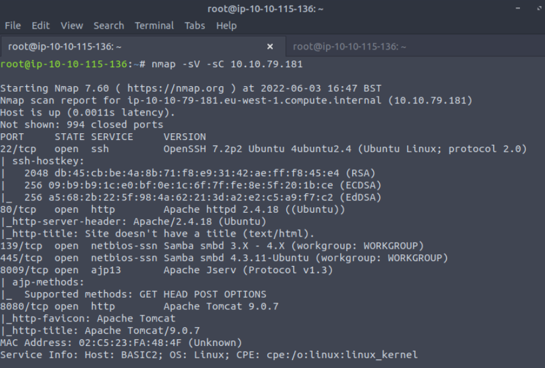
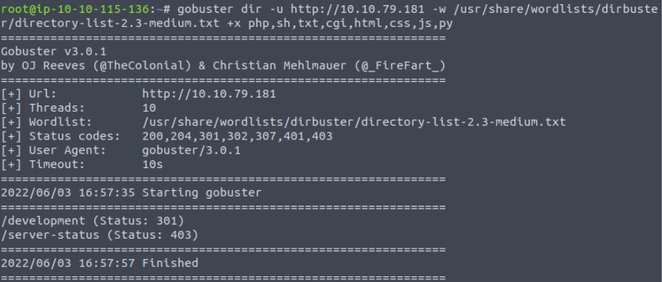
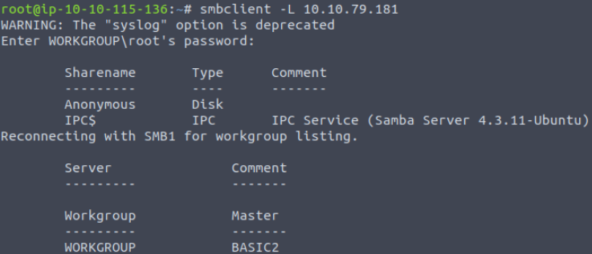
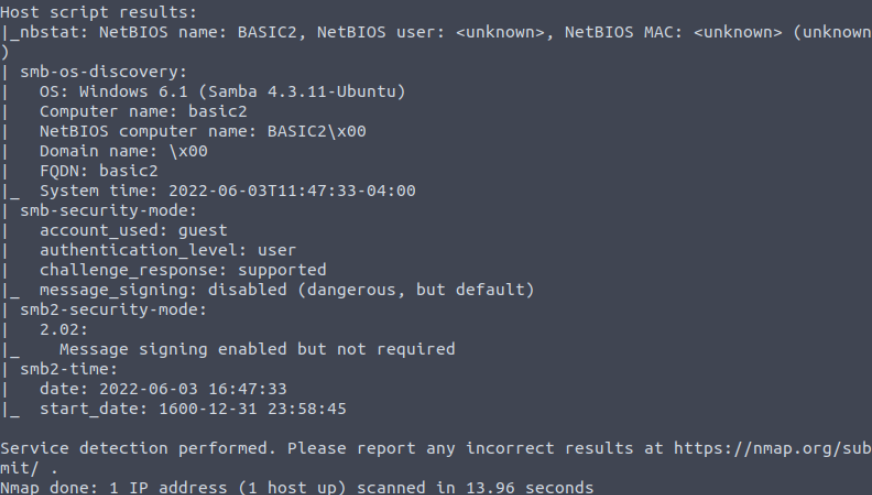
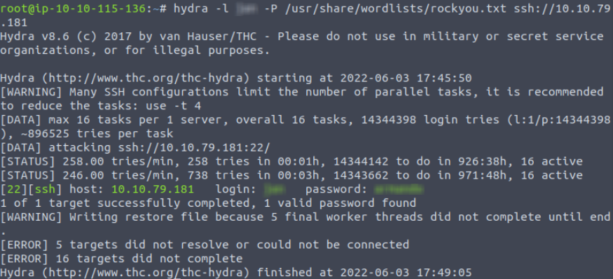
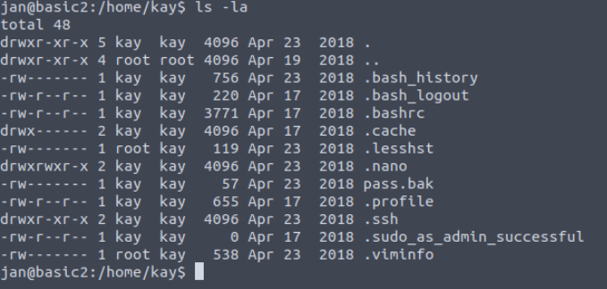
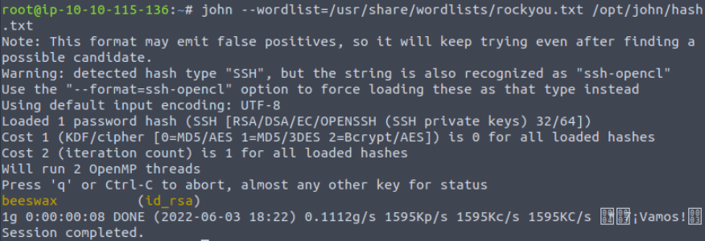

## TryHackMe | Basic Pentesting

### Question 1:

Start with an nmap scan against the target machine: 

```
nmap -sV -sC [Target IP]
```
We use -sV for a more verbose response, and -sC for standard scripts. Additionally, if you'd like to put the output into a file, you can add -oN [filename].



Our scan shows us that ports 22(SSH), 80(http), 139 and 445(SMB), 8009, and 8080 are open. Lets go check the webpage on port 80 first.

First thing to do is to check the page source to see if there's any hints/clues. You can right click and select view page source, or ctrl+U.

There's a note to "check the dev note section if you need to know what to work on." Lets jot that note down just in case it becomes relevant later.

### Question 2

Lets go ahead and start enumerating any additional directories with gobuster:
``` 
gobuster dir -u http://[Machine IP] -w /usr/share/wordlists/dirbuster/directory-list-2.3-medium.txt -x php,sh, txt,cgi,html,css,js,py
```
```
dir to specify directories

-u for the target URL

-w for the wordlist

-x list of extensions we want to check for
```


Gobuster has found what is presumably the dev page they were referring to in the source code of the website. 

On the page, there are two txt documents. One seems like a message from user K to user J, asking them to change their password to something stronger, and the other is a thread verifying their Apache server and SMB are both running.

### Question 3, 4 and 8

Now that we're done with this webpage, let's try enumerating the SMB ports. You can start by listing the shares with the command 
```
smbclient -L [Target IP]
```



Cool! There's an Anonymous share that we can try to access.

If you refer back to our nmap scan, the scripts we ran tell us the security mode of the smb share.



Because it's being used as a guest account, we should be able to access that Anonymous share without a password.

You can access the SMB Anonymous share with the command
```
smbclient \\\\[TargetIP]\\Anonymous
```
There's a staff.txt file on this share. We can put this share on our own machine and check out the contents. Based on the name, we should be able to get the names of J and K!
```
get staff.txt
```
Now exit the smbclient with ```exit``` and cat out the contents of the txt file.

As predicted, the txt file contains the names of J and K. We know J has a weak password, so lets try brute forcing their login with hydra!

### Question 5 & 6

If you're not familiar with hydra, the syntax is as follows:
```
hydra -l [user] -P [Password list] [service]://[TargetIP]
```
We're trying to brute force into ssh, so put ssh as the service and run the command!



Awesome! We've got our credentials. Lets ssh into the target machine!

``` ssh [user]@[TargetIP]```

Now that we have a foothold in the system, lets try and escalate our privileges and gain access to the Kay user.The first thing I like to do is check the commands I can run as sudo.

```sudo -l```

Unfortunately, it doesn't seem like we can use sudo as this user. Next I like to check and see what commands have SUID binaries. If you don't already know SUID binaries are commands that, when run, run as the root user. If there certain commands have the SUID bit, they can be exploited to escalate your privileges to root. To check for SUID binaries, you can use the command:
```
find / -perm -u=s -type f 2>/dev/null
```
You can check the binaries that show up here on gtfobins, but we don't have any luck here either. Lets do some more looking around in the /home/kay/ directory.



Lets check out her .ssh folder.

Inside are the authorized_keys, id_rsa and id_rsa.pub files. Lets check out the contents of the id_rsa file first, since this should be her ssh private key. 

If we copy the contents of the id_rsa file over to our machine and try to use it to ssh into the system as Kay, we'll be prompted for a password. To find this password, we're going to need a tool called ssh2john.

To access the command I had to use ```locate ssh2john``` and move to that actual directory before running it. Once you're there, you can use
```
./ssh2john.py [private key file] > hash.txt
```
Now that we have the hash file, we can just brute force it normally with John the Ripper!

```
john --wordlist=/usr/share/wordlists/rockyou.txt [Location of the hash file you just created]
```



Awesome! We've got the ssh key password now! Let's SSH in as Kay with the new password we have (make sure you've done ```chmod 600 id_rsa``` with the private key file first.

```ssh -i id_rsa kay@[TargetIP]```

And now we're in the system as Kay!

### Final Question

Literally just hit ls and cat out the pass.bak file. You've got your final flag!


## Congratulations on completing the Basic Pentesting Room!
