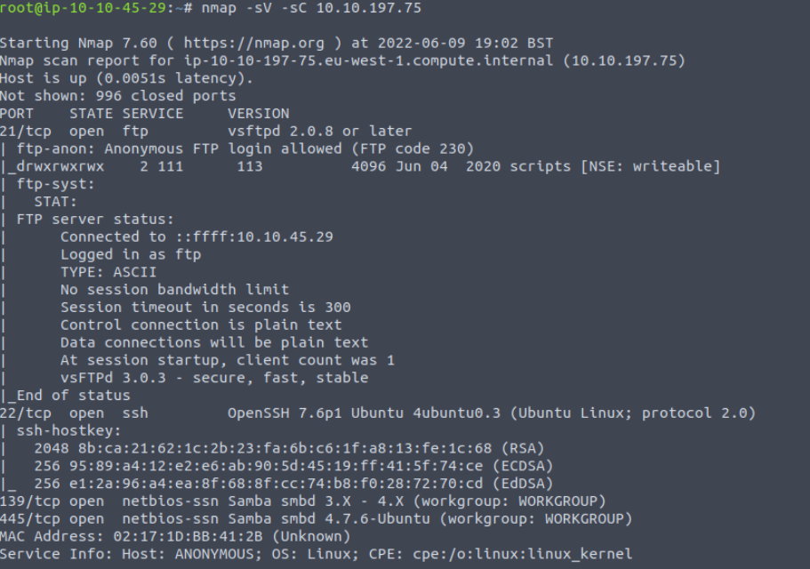
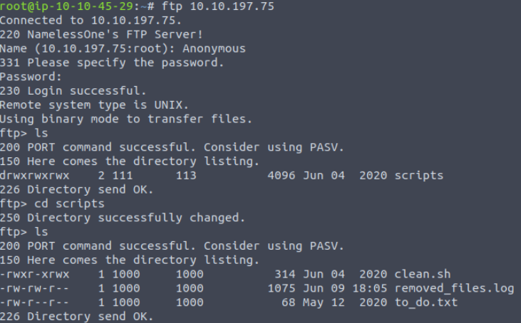
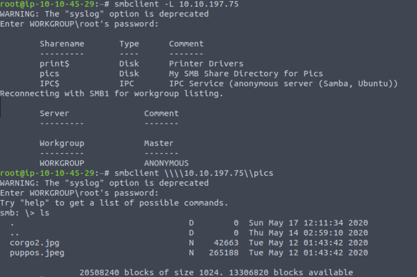
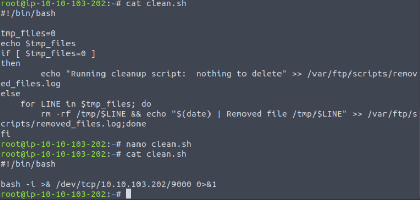
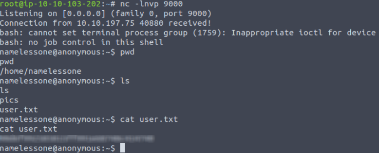
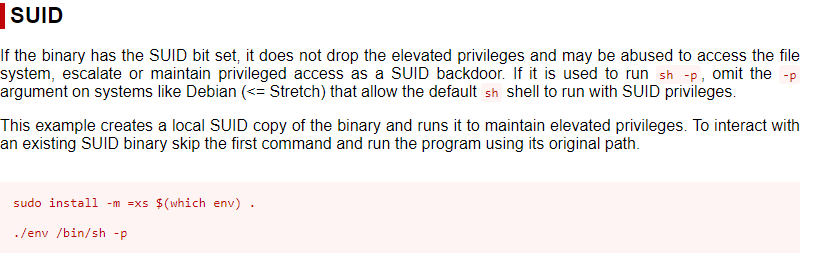
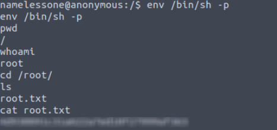

## TryHackMe | Anonymous

### Question 1, 2, and 3

Start with an nmap scan against the target machine: 

```
nmap -sV -sC [Target IP]
```
We use -sV for a more verbose response, and -sC for standard scripts. Additionally, if you'd like to put the output into a file, you can add -oN [filename].



Our scan shows us that ports 21, 22(SSH), 139 and 445(SMB),  open. Lets go check and see what's available on the FTP server.

### Question 4
In the ftp server we'll find a scripts folder, and inside that are 3 files. Grab all 3 files using the ```get``` command.



Next, lets check out the SMB server. You can enumerate the shares available on SMB by using 
```
smbclient -L [Target IP]
```
It looks like there's a pics share we can access. You can get into the smb share with the command
```
smbclient \\\\targetip\\share
```


Inside there are two image files, lets grab them both also using the get command.

Now lets go back and check out the files we've retrieved. From the FTP server, we have a script, removed_fules.log and a to_do.txt. The to_do file is useless here. However, the clean.sh file seems to be a cronjob file. So it runs automatically every so often. I wonder if we can put a bash reverse shell script inside the file, and replace the one on the ftp server! Lets try it.

### Exploiting the System

Grab the bash reverse shell from the pentest monkey reverse shell cheat sheet, and replace the contents of the clean.sh file with your reverse shell. (Make sure to remember to change the IP and port number!)



Now just replace the file on the ftp server, open your listener, and you should have your reverse shell after a little while.

### User Flag

Pretty simple, use `ls` and the user flag is right where we start. :)



### Root Flag

Now it's time for privilege escalation. Lets search for any SUID binaries we can take advantage of:
```
find / -perm -u=s -type f 2>/dev/null
```

There's an entry I don't recognize when I usually search for SUID binaries. Check out ```env``` on GTFObins.



Sure enough just type
```
env /bin/sh -p
```
and you are now root!



## Congratulations on completing the Anonymous room!
