## TryHackMe | Anthem

### Reconnaissance

Start with an nmap scan against the target machine: 

```
nmap -sV -sC [Target IP]
```
We use -sV for a more verbose response, and -sC for standard scripts. Additionally, if you'd like to put the output into a file, you can add -oN [filename].

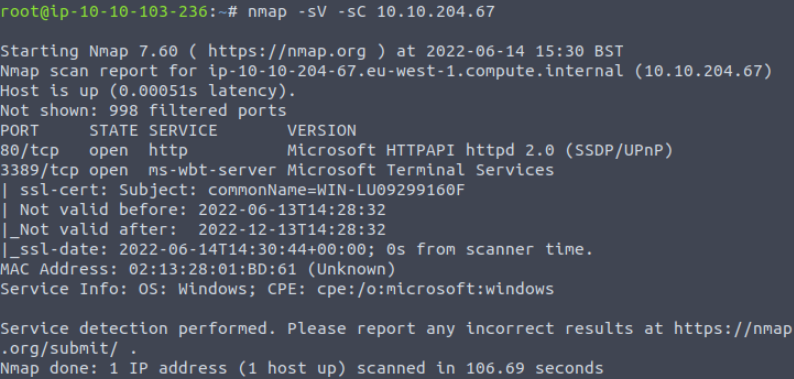

Our scan shows us that ports 80(http), and 3389 (RDP) are open. Lets go check the webpage on port 80 first.

### Website Analysis

We can first check out and see if there's a robots.txt file for this web server.

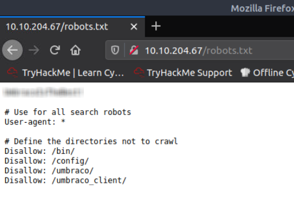

Looks like we've found something potentially interesting. Let's write this down for use later. (It's also one of the questions). On this same page there's references to a service called Umbraco. After doing some research, Umbraco is a CMS service for publishing content.

This question about finding the name of the admin actually stumped me for a bit until I clicked the hint. On the "Cheers to our IT depertment" page, search up the author of the poem written below, and you've got your answer.

If we go to the "We are hiring" page, we can find the author of the article: Jane Doe. The page also shows us her email address format, which is likely used by all employees.  

### Flags

We need to check the page source to see if there's any hints/clues. You can right click and select view page source, or ctrl+U.

Just scrolling through the page source we can find one of our flags (this one is actually flag 2)!

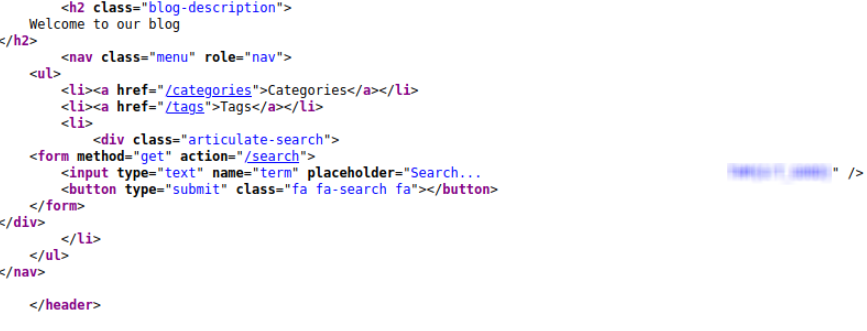

Lets go back to the "We are hiring" page, and we can inspect that page source too. We've found flag 1!

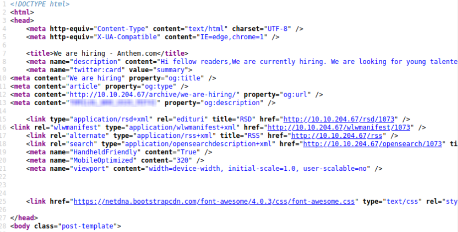

We can see the author of the blog, so let's check out her profile.

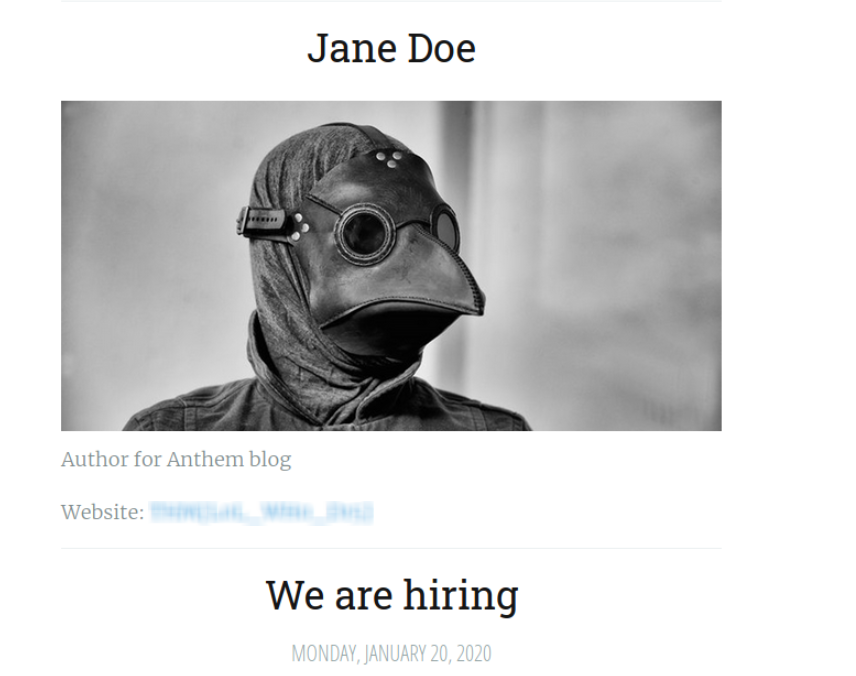

Imagine that! We have our third flag.

For our fourth and final flag, go to the "A cheers to our IT department" page, and check the page source.

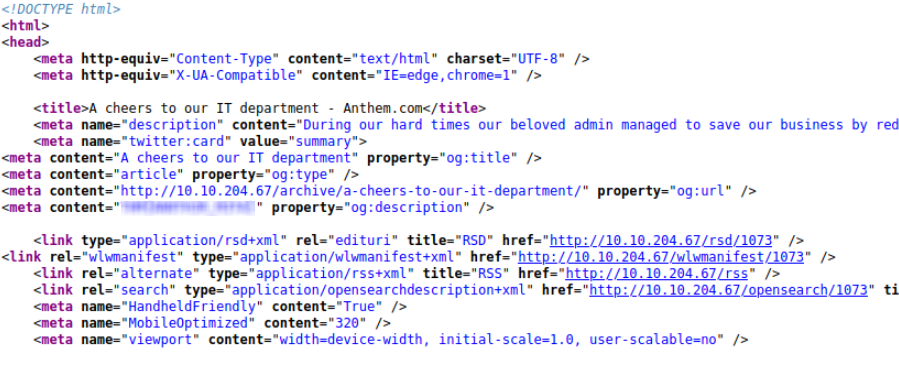

### Getting into the Box and User.txt

Going back to our Nmap scan, they had port 3389 open. This will be our way in. To access RDP, we can use FreeRDP:
```
xfreerdp /u:SG /p:{password from robots.txt} /v:{target ip}
```
Once you're in, you'll find the user.txt right on the Desktop

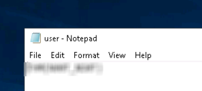

### Root.txt

The hint for the admin password says it's hidden. This tells me there's probably a hidden folder somewhere; probably on the C drive. To be able to see these hidden files and folders, we'll want to go to Control Panel > Appearance and Personalization > Folder Options and select the correct option. 

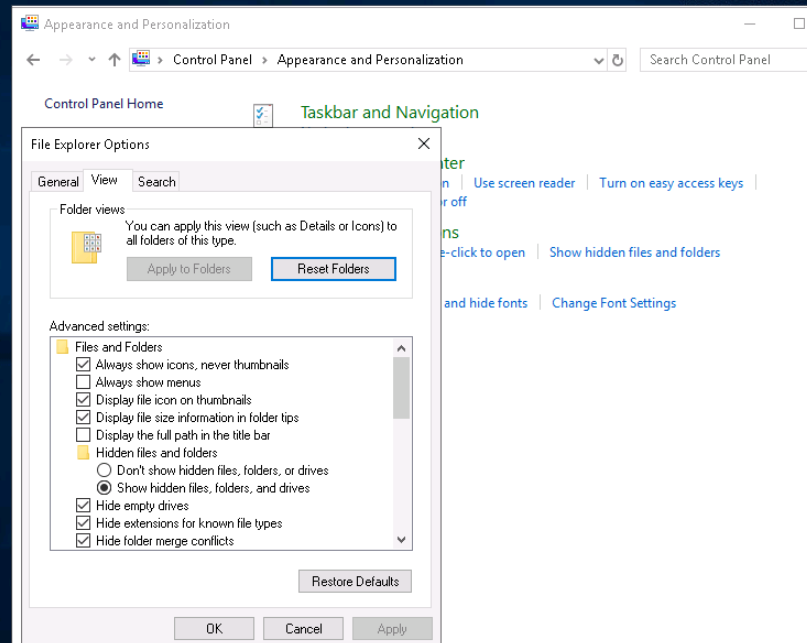

Now that this is done, there's a hidden backup folder in the C drive, with a txt file we dont have permission to read. Right click the txt file, go to Properties, and then the Security tab. We want to add the permissions for us to read the file. So hit Edit > Add > and in the Object Names box, put in our username: SG. Hit Check Names, and then Ok.

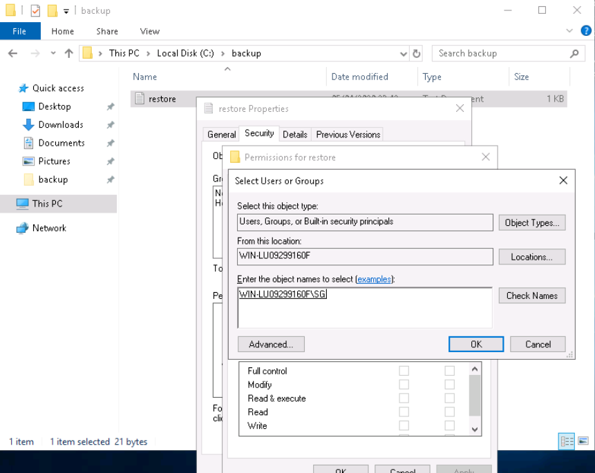

We can now give ourselves full control of the file! Once we've done that, we open the file to find our admin password.

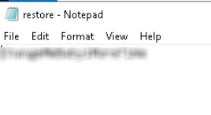

Now try to access the Administrator folder and use the password we've just gotten, and the root.txt file is on the Desktop.

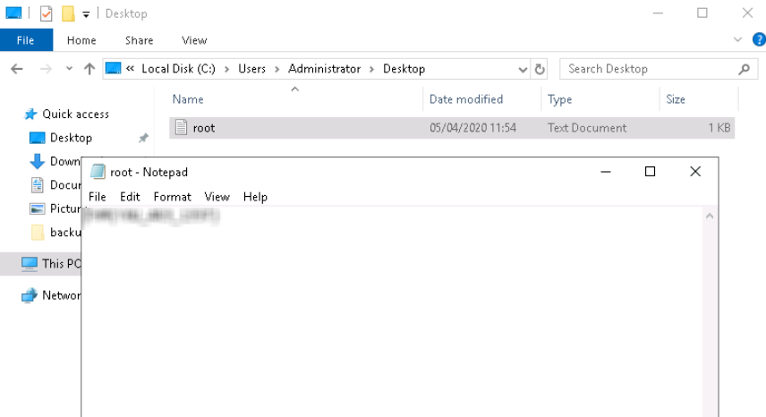

## Congratulations on completing the Anthem Room!
