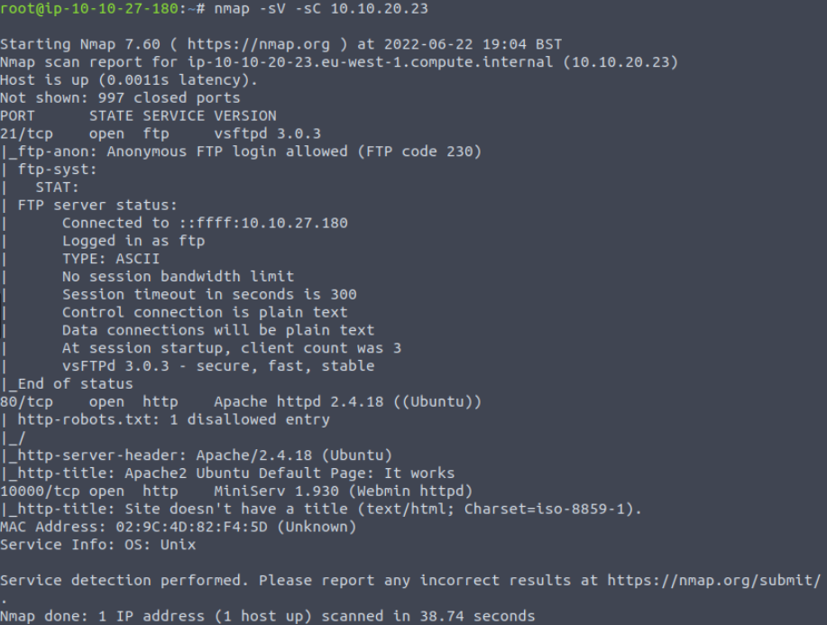
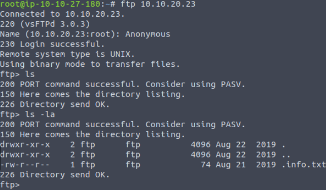
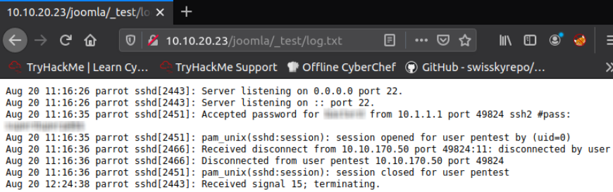
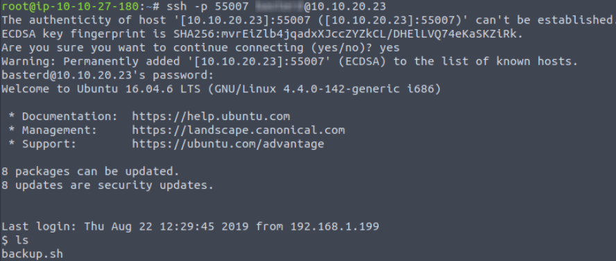
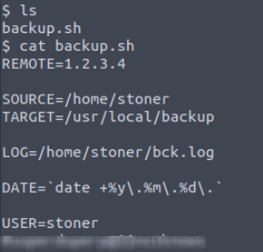
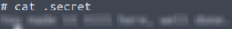
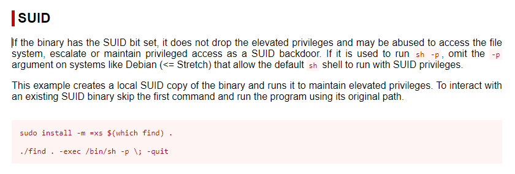
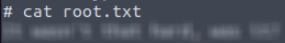

## TryHackMe | Boiler

### Questions 1-4

Start with an nmap scan against the target machine: 

```
nmap -sV -sC [Target IP]
```
We use -sV for a more verbose response, and -sC for standard scripts. Additionally, if you'd like to put the output into a file, you can add -oN [filename].



Our scan shows us that ports 21(FTP), 80(http), 10000 and 55007 are open. Port 10000 seems to be hosting a service called Webmin and port 55007 is hosting SSH. After doing some research into this service and version #, we'll find that it's something we cannot exploit.

Lets go check the FTP server that allows anonymous login first.

```
ftp [target IP]
```

Upon first glance, it seems like there's nothing in the FTP server. But if you use the ```-la``` tag along with the ```ls``` command, we'll find a hidden file.


Let's bring this txt file over to our machine using 
```
get .info.txt
```
If we cat out the contents, it's just an encrypted message that ends up with a dead end once we decrypt it.


### Question 5-7

Lets go ahead and start enumerating any additional directories with gobuster:
``` 
gobuster dir -u http://[Machine IP] -w /usr/share/wordlists/dirbuster/directory-list-2.3-medium.txt -x php,sh, txt,cgi,html,css,js,py
```
```
dir to specify directories

-u for the target URL

-w for the wordlist

-x list of extensions we want to check for
```


The manual page doesn't give us much to work with, but the ```/joomla/``` page is more interesting! We're going to try doing a gobuster scsan on that directory to see if we can find anything more interesting.

``` 
gobuster dir -u http://[Machine IP]/joomla -w /usr/share/wordlists/dirbuster/directory-list-2.3-medium.txt -x php,sh, txt,cgi,html,css,js,py
```

There's an interesting directory ```_test``` 

Now run a gobuster scan on that directory next, and you should find an interesting file. log.txt

Inside the log file shows what seem to be ssh credentials!



Make sure to use the ```-p [port]``` option since we aren't using SSH on port 22!




### Part 2

If we check the directory we were put into, we'll find a file called backup.sh. And inside that file are another set of credentials!



Now that we're the stoner user, we can use ```ls -la``` and find a file labeled .secret. This is actually our user flag!



Now lets work on escalating to root so we can retrieve our root flag. Search for any SUID binaries that can be taken advantage of:
```
find / -perm -u=s -type f 2>/dev/null
```

The binary that sticks out here is ```find```. If we refer to GTFObins, we can escalate to root pretty easily.



Once you enter this in, you are now root! You can find the root flag in ```/root/``` and the user flag in 



## Congratulations on completing the Boiler Room!
