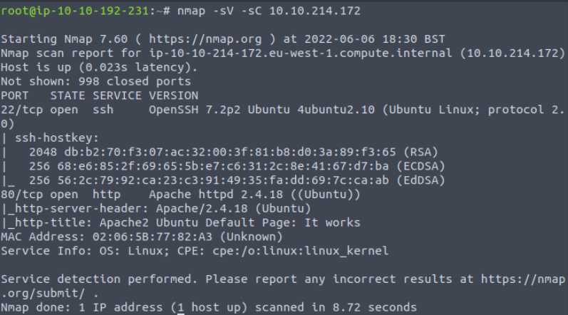
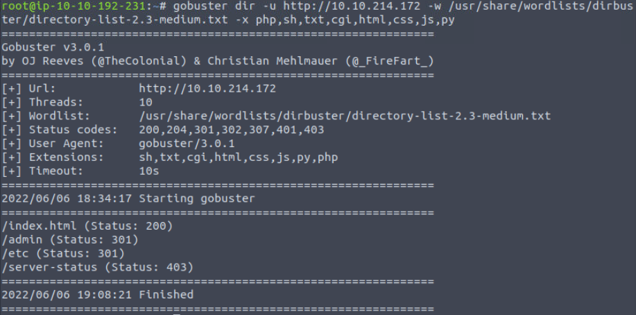
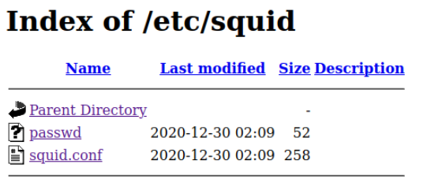
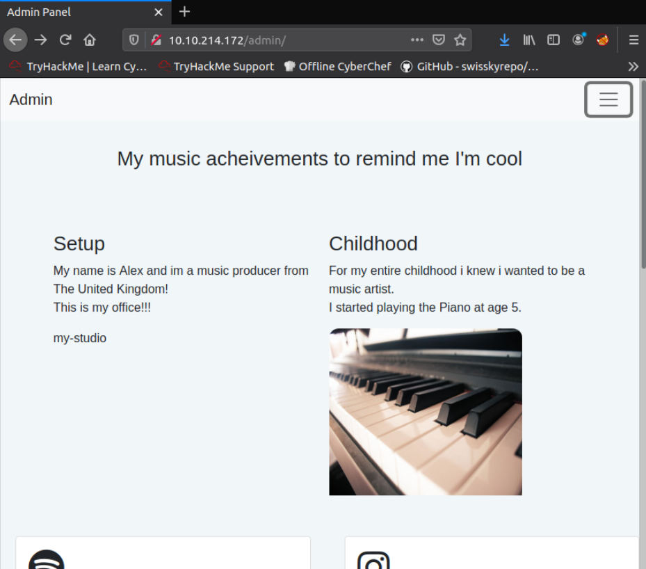
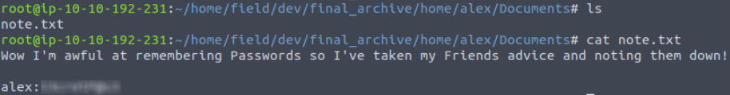
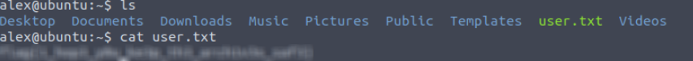

## TryHackMe | Cyborg

### Questions 1-3

Start with an nmap scan against the target machine: 

```
nmap -sV -sC [Target IP]
```
We use -sV for a more verbose response, and -sC for standard scripts. Additionally, if you'd like to put the output into a file, you can add -oN [filename].



Our scan shows us that ports 22(SSH) and 80 (http) open! 

First thing to do is to check the page source to see if there's any hints/clues. You can right click and select view page source, or ctrl+U.

There's nothing significant here, just a default Apache Ubuntu page, so lets hit the target with gobuster

``` 
gobuster dir -u http://[Machine IP] -w /usr/share/wordlists/dirbuster/directory-list-2.3-medium.txt -x php,sh, txt,cgi,html,css,js,py
```
```
dir to specify directories

-u for the target URL

-w for the wordlist

-x list of extensions we want to check for
```


Gobuster finds two interesting pages: /admin and /etc. In the /etc directory, there is a squid folder that leads us to two files, passwd and squid.conf.



The passwd file contains what seems to be a potential username and a hash, and a .conf file that could be important later.

First lets try to crack the hash we got from the passwd file by using John the Ripper. Make a new file with the hash you copied from the passwd file.

```
john --wordlist=/usr/share/wordlists/rockyou.txt [hash file]
```


Looks like we got a hit!

Before we do anything else, lets go check out the admin page.

The admin page takes us to a normal looking webpage.



If you click on the menu in the upper right hand corner, you'll be able to download an archive.tar file. Download it and use the following command to extract the contents of the file:

```
tar -xvf archive.tar
```
Once you've done this, you should find a new folder that you can follow all the way to /home/field/dev/final_archive

Check out the documentation that's included in the README file (the link).

After doing some research, you'll find that this is a borg backup archive, and we need to extract the contents. To do that we'll need to do:

Note: If you don't already have borg backup installed, you'll need to run ```apt install borgbackup``` first

```
borg extract [path to the archive]::[username]
```
Use the password we got from the hash that we cracked earlier.

Now list out the files in the directory and you'll notice we have a new ```home``` directory to check out. After following to ```/home/alex``` you'll notice we have access to the backup of alex's directory!

Check the ```Documents/``` directory and we'll a note that contains what's probably some ssh credentials. Let's try them out!



Sweet! We're in!

### Question 4

Now that we're in the system, it should we pretty easy to find our first flag, user.txt. Sure enough, it's the first thing we find!



### Question 5

Time to escalate our privileges and get the root flag. We should first check and see what commands we can run with sudo.
```
sudo -l
```
Looks like we can run a script called backup.sh as root in the /etc/mp3backups folder. Upon checking the contents, you'll notice that it's taking input from the command line when you run it. And when you run it with sudo, you have root privileges, which means we can input any command! Just try doing ```sudo /etc/mp3backups/backup.sh -c id``` and see what the output is!

So first what we want to do is add the suid bit to the /bin/bash command, so we can spawn a new shell as root.
```
sudo /etc/mp3backups/backup.sh -c "chmod +s /bin/bash"
```
Now just run bash with:
```
bash -p
```
We are now the root user!

You can find the root flag in the /root/ directory as always. Thanks for reading!

## Congratulations on completing the Cyborg Room!
