## TryHackMe | Mr. Robot CTF

### Recon

Start with an nmap scan against the target machine: 

```
nmap -sV -sC [Target IP]
```
We use -sV for a more verbose response, and -sC for standard scripts. Additionally, if you'd like to put the output into a file, you can add -oN [filename].

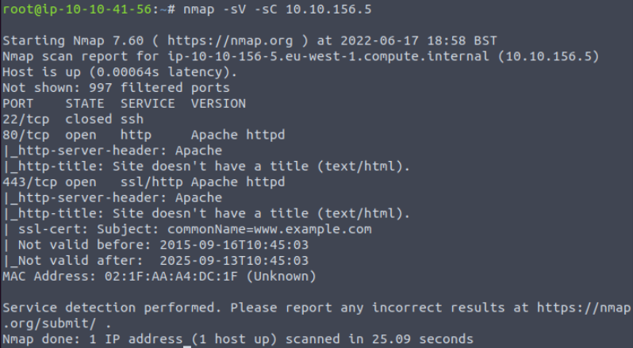

Our scan shows us that ports 22(SSH), 80 (http) and 443 (https) are open! 

We're greeted with a bunch of code running, and are prompted with this screen:

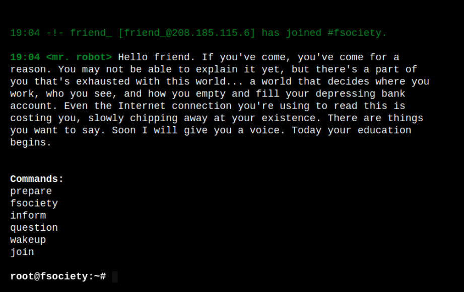

All the commands we enter at prompted play really cool videos with references to the show "Mr. Robot" (dope show btw. Check it out if you haven't seen it), and the page sources don't give much information either. Lets run a gobuster scan to find any hidden directories.

``` 
gobuster dir -u http://[Machine IP] -w /usr/share/wordlists/dirbuster/directory-list-2.3-medium.txt -x php,sh, txt,cgi,html,css,js,py
```
```
dir to specify directories

-u for the target URL

-w for the wordlist

-x list of extensions we want to check for
```
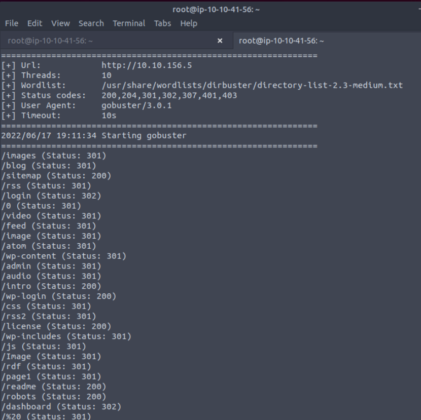

Gobuster Gives us so many options. However the most interesting directories are anything with a 302 or 200 status code. Starting from the top, the notable ones are:
```
/login (same thing as /wp-login)
/license
/readme
/robots
/dashboard
```
/login presents us with a wordpress login page. Obviously we can't do anything with this for now. The /license directory doesn't have anything interesting at first glance, but at the bottom it looks like theres some base64 code. We can decode it using cyberchef.

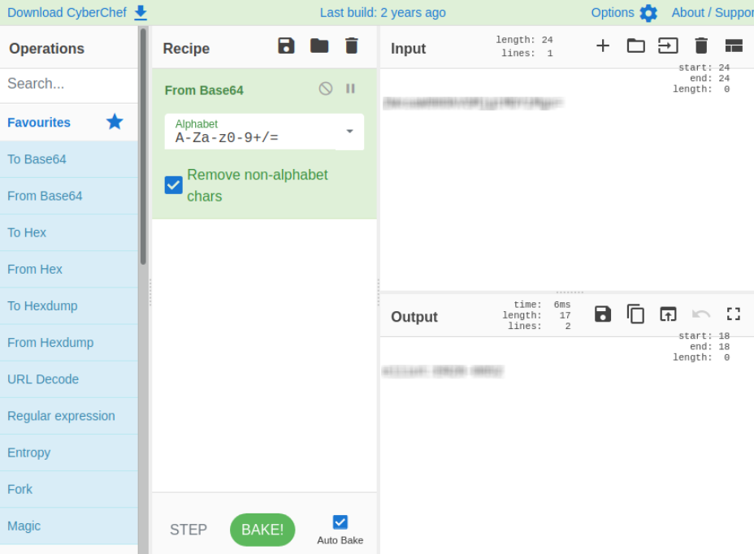

It looks like this gives us a potential username, and maybe a password. Could this be for our wordpress login?

### Key 1

/readme is a false flag, we can disregard it. /robots is much more interesting. It lists a .dic file and the file of our first key! I decided to try using curl to access the information in both files
```
curl http://[targetIP]/key-1-of-3.txt
curl http://[targetIP]/foscity.dic
```
This method gets us out first key!

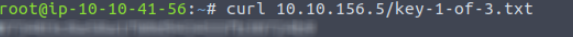

The .dic file is just a wordlist. We're going to download this wordlist using wget:
```
wget http://[TargetIP]/foscity.dic
```
This is probably a wordlist we're going to need later. But for now, lets just go back to our login page. Using the credentials we got from the base64 code should get you in just fine. From here, we can go to the Appearance tab on the left, and select the editor option. This page will allow us to replace source code with whatever you want. In our case, we want to use a php reverse shell. Go grab a reverse shell from pentest monkey, and open up your netcat listener with:
```
nc -lnvp [desired port]
```
Now you're going to want to go to the Archives page on the right hand side, and paste your reverse shell. The reason we're using the Archives section is because it's less destructive than using any of the other pages.

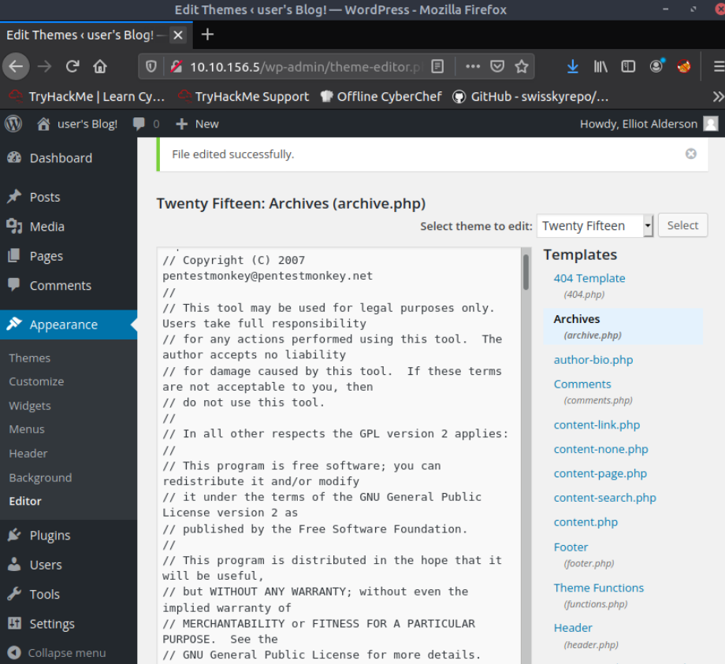

With your netcat listener open, hit "Update File" at the bottom, and navigate to ```http://[targetIP]/wp-content/themes/twentyfifteen/archive.php```

We now have access to the machine!

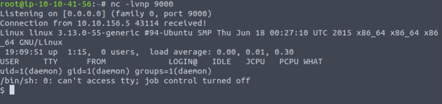

### Key 2

One of the first things I like to do when I gain access to a machine is to attempt to upgrade the shell I have. We can do this using the command:
```
python -c 'import pty; pty.spawn("bin/bash")'
```
From here you can navigate to the ```/home/robot``` directory to find key 2. However, it doesn't look like we have access. But we can read the file ```password.raw-md5``` which seems to have login credentials for the user "robot"

We can either crack this has using john the ripper, or the online service https://crackstation.net. I chose to use crackstation here but either works.

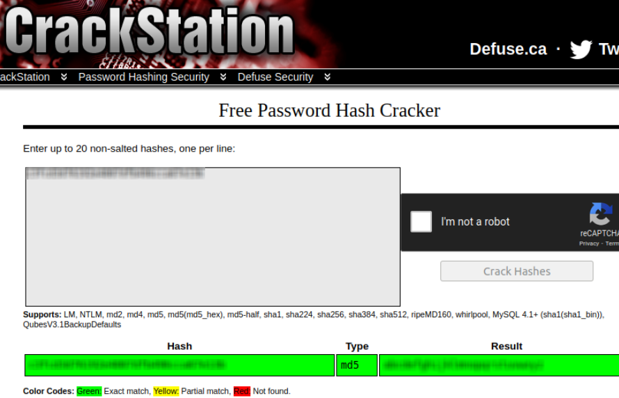

With the hash cracked, we can now log in as the robot user and retrieve key 2!

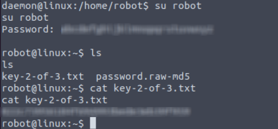

### Key 3

Now we'll need to escalate our privileges and access the contents of key 3, which is typically in the root directory.

When we search for any out of place SUID binaries to potentially exploit, we want to use this command:
```
find / -perm -u=s -type f 2>/dev/null
```
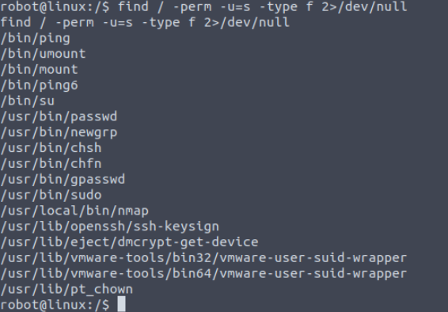

Nmap definitely should not be here, let's see how we can exploit this SUID binary using gtfobins.

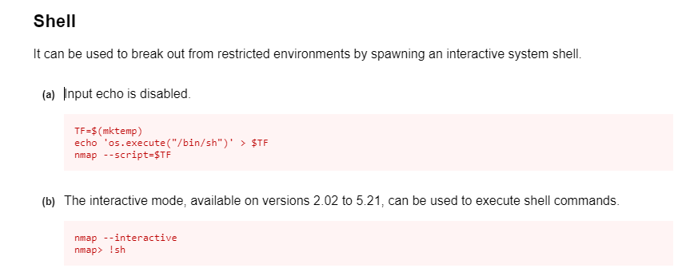

Just use the commands as stated, and you'll obtain root access! Now head to the root directory and grab the final key.


## Congratulations on completing the Mr. Robot Room!

If you haven't seen the show already, I highly suggest you do.
