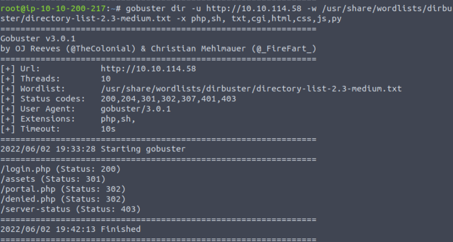
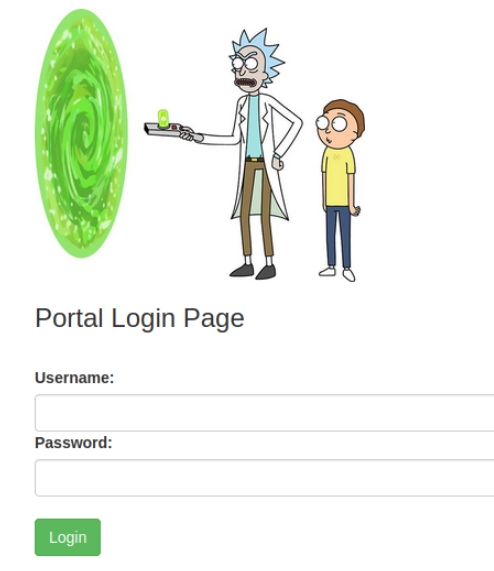
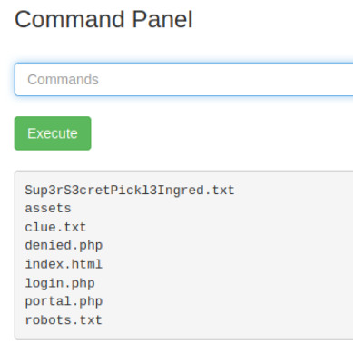
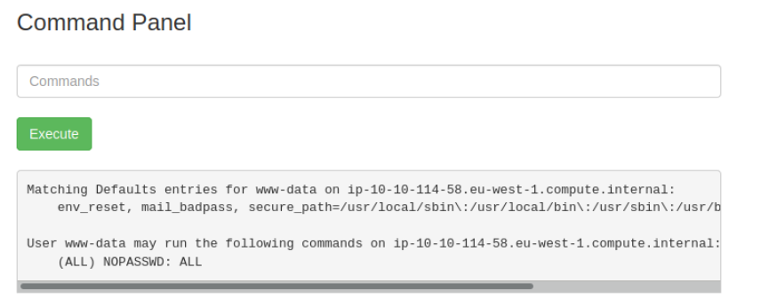
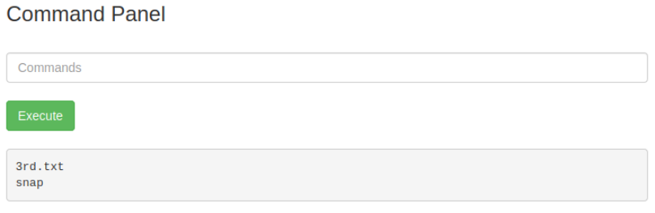

## TryHackMe | Pickle Rick

### Step 1: Recon:

Start with an nmap scan against the target machine: 

```
nmap -sV -sC [Target IP]
```
We use -sV for a more verbose response, and -sC for standard scripts. Additionally, if you'd like to put the output into a file, you can add -oN [filename].

Our scan shows us that ports 22 (SSH) and 80 (http) are open. Lets go check the webpage first.

First thing to do is to check the page source to see if there's any hints/clues. You can right click and select view page source, or ctrl+U.

At the bottom of the page we'll find a note left by someone with a username. We're not sure what this is used for yet, so we'll just take a note of it and continue with our enumeration.

Most websites typically have a robots.txt file that holds instructions for bots that provide rules for what webpages they can and can't access. So lets go and check that as well!

![PickleRickRobotsTxt] (THMScreenshots/PickleRick/PickleRickRobotsTxt.png)

Robots.txt brings us to a blank webpage with just this string of text. This could possibly be useful later, maybe it goes with the username we found in the source code of the original webpage.

Lets go ahead and start enumerating any additional directories with gobuster:
``` 
gobuster dir -u http://[Machine IP] -w /usr/share/wordlists/dirbuster/directory-list-2.3-medium.txt -x php,sh, txt,cgi,html,css,js,py
```
```
dir to specify directories

-u for the target URL

-w for the wordlist

-x list of extensions we want to check for
```


Our gobuster gives us some interesting things to check out. Specifically, the login.php page. 

### Flag 1



Trying the potential credentials we found on the earlier web pages allows us to log into the portal, and we're presented with a command panel. Let's try using a basic command like ls to see what kind of things we can do.



It looks like we've found one of the ingredients! Unfortunately, the cat command seems to be disabled in this command panel. But if you notice, all the other things listed are pages that were listed in our directory search. Go to http://[MachineIP]/Sup3rS3cretPickl3Ingred.txt to get the first ingredient.

### Flag 2

Among the other things we found when using ls was a file called clue.txt. Going to that page tells us to look around the file system for the other ingredient. So lets try listing out the contents of the home directory.

``` ls /home/ ```

We find a directory for Rick, lets check that out too.

```ls /home/rick```

There's a file for the second ingredients, but as you know we cannot use the ```cat``` command to read files here. We'll have to find an alternate method of reading files. Fortunately, we have the internet! A quick search gives us a few options. The first one I ran into that worked was the ```less``` command.

```
less /home/rick/"second ingredient"
```

There's our second ingredient!

### Flag 3

Now we just need the last and final flag. Usually these are in the root folder. Trying ```ls /root/``` doesn't do anything, so lets see what sudo commands we have access to with ```sudo -l```



Perfect! We can sudo anything without being asked for a password. We can check and see what's in the root directory with:

```sudo ls /root/```



To get the contents of the final ingredient we'll use ```less``` again!

```sudo less /root/3rd.txt```

## Congratulations! You've completed the Pickle Rick Room!
